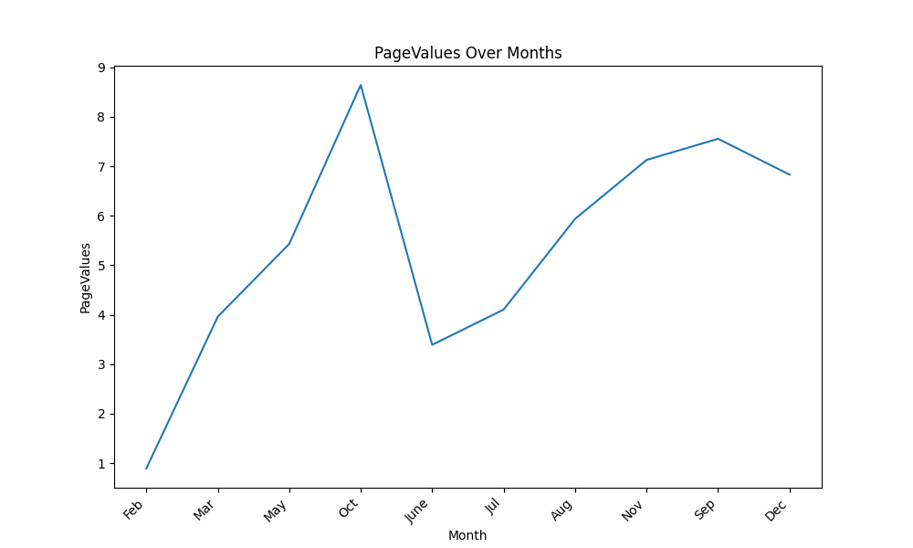
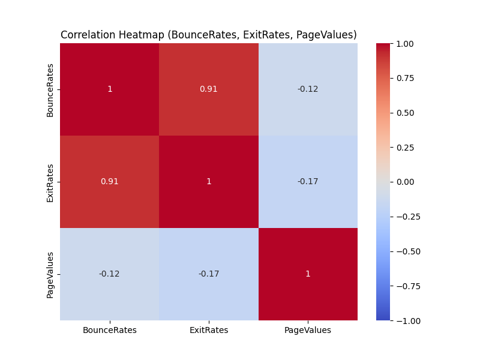

# Analyse de l'Intention d'Achat des Acheteurs en Ligne

Ce projet se concentre sur l'analyse des facteurs influençant l'intention d'achat des acheteurs en ligne. Le jeu de données utilisé dans cette analyse se compose de 10 attributs numériques et 8 attributs catégoriels, avec l'attribut "Revenue" servant de label de classe.

## Description du Jeu de Données

### Attributs Numériques :
- "Administratif", "Durée Administrative", "Informatif", "Durée Informatif", "Produit Associé" et "Durée Produit Associé" représentent le nombre de types de pages différents visités par le visiteur au cours de cette session et le temps total passé sur chacune de ces catégories de pages. Ces valeurs sont dérivées des informations d'URL des pages visitées par l'utilisateur et sont mises à jour en temps réel lorsqu'un utilisateur effectue une action.
- Les caractéristiques "Taux de Rebond", "Taux de Sortie" et "Valeur de la Page" représentent les mesures effectuées par "Google Analytics" pour chaque page sur le site de commerce électronique.
   - Le "Taux de Rebond" se réfère au pourcentage de visiteurs qui entrent sur le site depuis une page et la quittent ("rebondissent") sans déclencher d'autres requêtes vers le serveur d'analyse pendant cette session.
   - Le "Taux de Sortie" est calculé comme le pourcentage de toutes les pages vues pour lesquelles c'était la dernière de la session.
   - La "Valeur de la Page" représente la valeur moyenne d'une page Web visitée par un utilisateur avant de réaliser une transaction de commerce électronique.
- "Jour Spécial" indique la proximité du moment de la visite sur le site à un jour spécial spécifique (par exemple, la fête des mères, la Saint-Valentin) lors duquel les sessions sont plus susceptibles d'être finalisées par une transaction. 

### Attributs Catégoriels :
- Système d'Exploitation
- Navigateur
- Région
- Type de Trafic
- Type de Visiteur (Visiteur Récurrent ou Nouveau Visiteur)
- Week-end (Valeur booléenne indiquant si la date de la visite est un week-end)
- Mois de l'Année

## Prétraitement des Données et Analyse

Dans ce projet, nous avons effectué différentes étapes de prétraitement des données, notamment le traitement des valeurs manquantes, la conversion des valeurs ordinales et l'encodage one-hot, la mise à l'échelle et la division des données en ensembles d'entraînement et de test. Nous avons utilisé la régression logistique pour l'entraînement du modèle.

## Analyse des Données Exploratoires (EDA)

Dans un cahier de notes distinct, nous avons réalisé une analyse exploratoire des données pour mieux comprendre le jeu de données. Nous avons créé plusieurs types de visualisations, notamment des graphiques de densité, des histogrammes, des boîtes à moustaches et des graphiques linéaires, afin d'obtenir des informations sur la distribution des données et les relations entre elles.
## Visualisation des Données et Analyse

Dans cette section, nous présentons des visualisations des principales découvertes tirées du jeu de données.

### PageValues au Fil des Mois

Le graphique en ligne ci-dessous illustre comment la métrique "PageValues" évolue tout au long de l'année :

**Analyse :**
Nous pouvons observer une tendance notable dans la métrique "PageValues" à mesure que nous avançons dans les mois. Les valeurs ont tendance à augmenter à mesure que nous approchons du quatrième trimestre (Q4) de l'année. Cette tendance est attendue et peut être attribuée à la saison des fêtes, qui comprend des événements tels qu'Halloween, Thanksgiving et Noël. Pendant cette période, les gens ont tendance à passer plus de temps à naviguer sur Internet pour rechercher et acheter des cadeaux, ce qui se traduit par des "PageValues" plus élevées. Cette observation correspond à l'augmentation typique des activités d'achat en ligne pendant la période des fêtes.

### Analyse de Corrélation : Taux de Rebond (BounceRates), Taux de Sortie (ExitRates) et PageValues

Nous avons effectué une analyse de corrélation entre les caractéristiques "Taux de Rebond" (BounceRates), "Taux de Sortie" (ExitRates) et "PageValues". La heatmap résultante révèle des informations intéressantes :

**Analyse :**
En examinant la heatmap, nous constatons qu'il y a peu de corrélation entre les "Taux de Sortie" (ExitRates) et les "PageValues", avec un coefficient de corrélation de -0,17. Cette observation peut sembler contre-intuitive à première vue. Cependant, elle suggère que le pourcentage de visiteurs qui quittent une page et la valeur moyenne des pages visitées n'ont pas de forte relation linéaire. Il est essentiel de prendre en compte que les coefficients de corrélation mesurent uniquement les relations linéaires, et des interactions complexes peuvent exister entre ces variables qui ne sont pas capturées par cette métrique.

Une analyse et une exploration plus approfondies peuvent être nécessaires pour comprendre en détail la relation nuancée entre les "Taux de Sortie" (ExitRates) et les "PageValues".

### Autres Graphiques

En plus des analyses ci-dessus, nous avons créé plusieurs autres visualisations, notamment des graphiques de densité, des histogrammes et des boîtes à moustaches, pour mieux comprendre la distribution et les relations au sein du jeu de données. Ces visualisations se trouvent dans les cahiers de notes associés.

## Dataset

Le jeu de données utilisé dans ce projet provient de la source suivante :

- [Dataset Source] (https://www.kaggle.com/datasets/imakash3011/online-shoppers-purchasing-intention-dataset)

## Remerciements

Ce projet utilise le jeu de données "Online Shoppers Purchasing Intention", initialement publié dans l'article suivant :

Sakar, C.O., Polat, S.O., Katircioglu, M. et al. Neural Comput & Applic (2018).

---

N'hésitez pas à nous contacter si vous avez des questions ou si vous avez besoin de plus d'informations sur ce projet.
